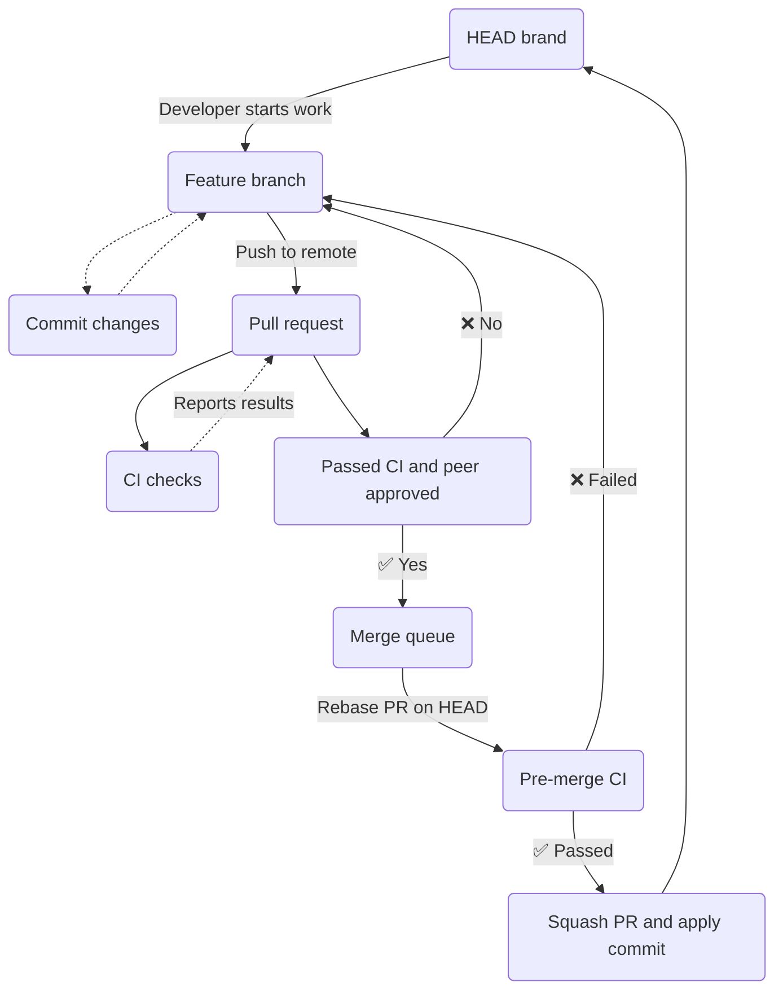

```mermaid
flowchart TD
  main(HEAD brand) -- Developer starts work --> fb(Feature branch)
  fb -.-> commit(Commit changes) -.-> fb
  fb -- Push to remote --> pr(Pull request)
  pr --> ci(CI checks) -. Reports results .-> pr
  pr --> pass(Passed CI and peer approved) -- "✅ Yes" --> merge(Merge queue)
  pass -- "❌ No" --> fb
  merge -- Rebase PR on HEAD --> mergeci(Pre-merge CI)
  mergeci -- "✅ Passed" --> amerge(Squash PR and apply commit) --> main
  mergeci -- "❌ Failed" --> fb
```
