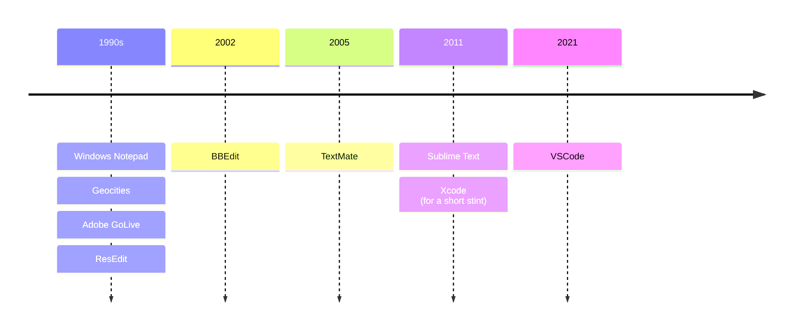

import { Image } from 'astro:assets';
import VSCode from '../../images/blog/2024-03/vscode.png';

I just spent far too long trying to bend [Zed](https://zed.dev) to my will. It reminded me of how I needed multiple weeks on and off configuring and reconfiguring VSCode to work for me. It is rare that the defaults provided in a code editor work for me. So I tried, and I've given up for a few very important (to me) reasons.

But before that, all of this takes me back to my history with code editors. The main theme that's stuck with me across each one is that I want it to be a _code editor_. Not an IDE. I don't want a terminal, I don't want to run tests, I don't want a million and one features that are better handled by other tools and apps.

## Code editor timeline

An approximate timeline, as near as I can remember would look something like this:

### 1990s - Script kiddie

I started nerding out with various things when I was too young to even know what I was doing, but I had fun doing it. I worked on all kinds of various things, but nothing noteworthy. I do remember having a Windows computer at home as our main machine for a stint on which I used Windows Notepad.

### 2002 - BBEdit

About this time I started ditching Adobe GoLive and going all in with BBEdit. I landed a job on my college campus building websites for our student union, student groups, and more. I got really good at writing HTML by hand. CSS was really just starting to proliferate and I was hooked.

### 2005 - TextMate

TextMate was already available, but we didn't make the switch until it was really getting popular. TextMate did everything I needed and nothing more.

### 2011 - Sublime Text

I've spent more time using Sublime Text than any other editor. I would be really interested in knowing the full stats of hours spent in the application over the course of ~10 years.

I loved Sublime Text. It was fast, boosted my productivity, and simple – nothing about Sublime Text ever got in my way.

### 2021 - VSCode

I _begrudgingly_ switched to VSCode. I never wanted to. In fact, over the course of at least three years, I tried to sit down and force myself to use it and configure it to my liking for a week at a time on at least four different occassions.

VSCode was slow. It does far too much for a "code editor" and is nearly a full-blown IDE… and at this point, with the right extensions, it _is_ a full IDE.

I really only switched to VSCode for a few reasons:

1. The Sublime Text LSP for TypeScript sucked (and it still sucks). "Go to definition" rarely, if ever works.
1. SublimeLinter is very difficult to configure correctly.
1. As a principal-level leader who needed to spend a lot of time pair-programming and teaching others, it was too difficult to not work in the same editor everyone else was.

I finally got VSCode to a point where it typically is not noticeably slow and 90% of its features are tucked away, hidden, or completely disabled. These are the things that are either unnecessary or poorly implemented for me:

- Terminal: tends to be problematic or have integration issues
- Debugger: takes too long to set up and configure for every project. I just use Node's `--inspect --inspect-brk` flags and pop open an inspector in a chromium-based browser
- _All the tooltips_: VSCode is way too aggressive about showing overlay hints and tooltips while I'm typing. I'm still typing. I actually type pretty darn fast, but these tooltips appear even faster and they're always wrong.
- Disabled/hidden: Most of the UI panels other than the explorer view
- The search UI is horrible. I've moved it over to a panel, but it's missing the ability to do regex replacements. You _have to_ use the side bar's find tab for this.

  <Image src={VSCode} alt="A minimal approach of using VSCode with most panes and features disabled." />

## Trying something new

I recently tried to go back to Sublime Text, but I just couldn't figure out how to get by the same first two issues that led me to switching to VSCode in the first place. So I threw that out the window.

I have the following hard requirements for an editor:

1. Ability for custom keyboard shortcut snippets.

   I've used the same custom snippet since my days with BBEdit: <kbd>CMD+CTRL+,</kbd> will add `

` and highlight `div` to change to any other HTML tag. I must use this snippet hundreds of times per day and I cannot live without it.

2. Two & three pane views.

   The panes need to stay open even when there is no file open in them. As visible in my VSCode screenshot above, keeping the panes open prevents any sort of unwrap/reflow of text in the open pane.

3. Stop shoving AI at me.

   I prefer to write things myself and know what I'm actually doing instead of hoping that an LLM connected the dots between keywords and syntax correctly.

4. "Go to definition" must actually work.

   Including going to definitions from `node_modules` (which Sublime Text doesn't support).

### Zed

Non-starters:

- Missing custom snippets. The inability to add my snippets in Zed made it a non-starter (and I spent a good hour scouring through discussions and issues trying to find a solution).
- Extra panes disappear when empty and there's no way to prevent that.

Annoying, but I can live with:

- I absolutely hate that the settings are only in JSON. This is actually the same as Sublime Text, but annoyingly, you have to manually open both the defaults and your custom settings in order to know what is actually possible.

- Minimal/lack of documentation on how to configure key bindings.

  I can eventually get used to different key bindings for things, but the syntax currently requires I know the internals of Zed and its code to perform actions.

- AI - at least it can be disabled, but how do I _know_ that what I'm writing isn't being fed to some machine to learn from?

### Lapce

Honestly, I didn't spend enough time here and I probably should, but…

Non-starters:

- Like Zed, no snippet support.
- Extra panes disappear when empty and there's no way to prevent that.

Annoying and I don't want to deal with:

- It feels like it's trying to be VSCode with all the features, bells & whistles, but I can't make them go away.
- No native OS X menubar

Super annoying, but I can live with:

- I closed a couple panels upon first open and I can't figure out how to get them back.
- What the heck goes in the right panel? It's just blank and click/right-click does nothing in it.
- It took me a good 5 minutes to figure out how to open a folder/project in the editor.

---

## Sitting for now

I guess I'll be sitting with VSCode for now. Despite my annoyances – at least most of them can be hidden away or disabled.
